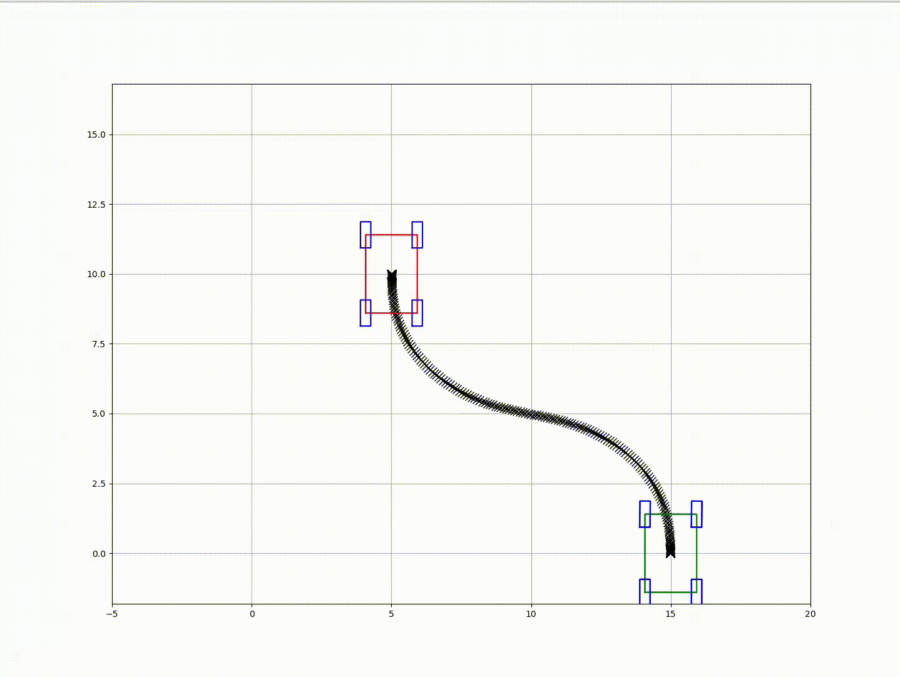
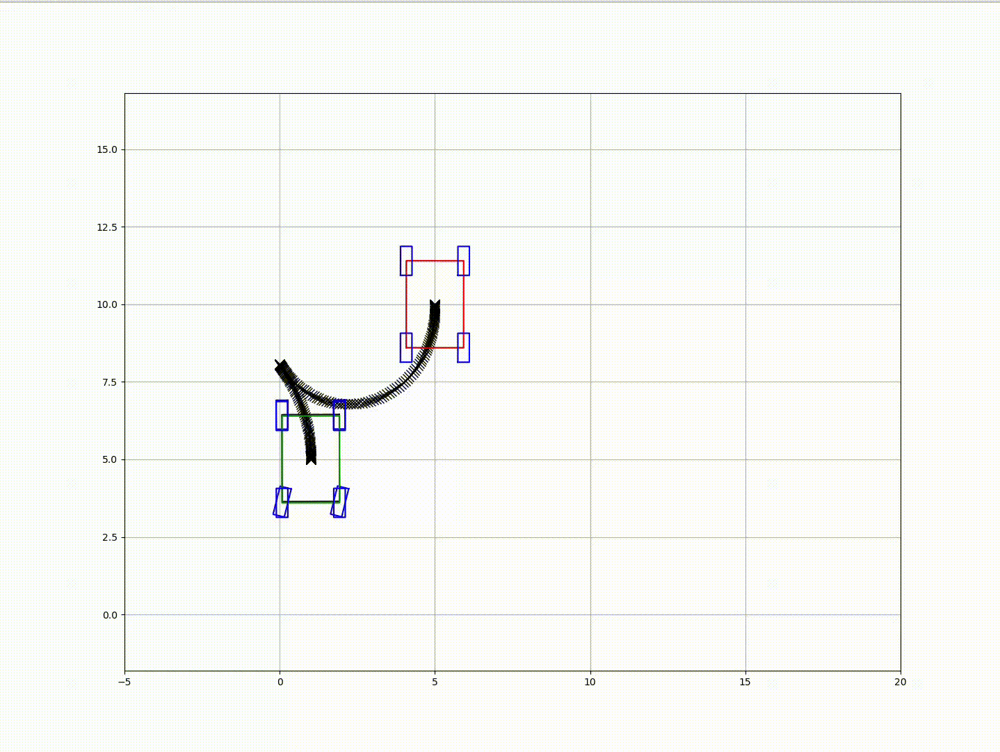

# Optimal Parking
[](https://github.com/CMaybe/Optimal-Parking/actions/workflows/optimal-parking.yaml)

Optimal Parking is a project designed to optimize vehicle trajectories for parking scenarios using advanced mathematical models and optimization techniques. Visualization is handled via **matplotlibcpp**

## Dependencies
To build and run this project, the following dependencies are required:

- **C++ Compiler**: A C++17 compatible compiler (e.g., `g++`, `clang`).
- **CMake**: Version 3.27.4 or higher.
- **Eigen**: Version 3.4.0 for matrix operations ([Eigen Official Site](https://eigen.tuxfamily.org/)).
- **yaml-cpp**: For parsing YAML configuration files.
- **OsqpEigen**: Version 0.10.0 for quadratic programming ([OsqpEigen GitHub](https://github.com/robotology/osqp-eigen)).
- **matplotlibcpp**: For real-time visualization ([matplotlibcpp GitHub](https://github.com/lava/matplotlib-cpp)).
- **Python3**: For `matplotlibcpp` and `numpy` integration.


## Getting Started on Devcontainer (Recommended)
This repository is configured with a `devcontainer` for Visual Studio Code, allowing you to quickly set up and use the development environment using Docker.

### 1. Clone the Repository
```bash
git clone https://github.com/CMaybe/Optimal-Parking.git
cd Optimal-Parking
code .
```
### 2. Open in VSCode

Open the cloned repository in Visual Studio Code. VSCode will detect the devcontainer configuration and prompt you to reopen the folder in the container.

### 3. Reopen in Container

Follow the prompt to reopen the repository in the Docker container. VSCode will build and start the container as defined in the .devcontainer directory, setting up the development environment according to the configuratio.

#### (Option: Access the Container Directly)
If you prefer to access the container directly, you can use the following command:

```bash
xhost +local:docker
docker exec -it dev-optimal-parking /bin/bash
``` 

We also prepared Docker image [dev-optimal-parking](https://github.com/users/CMaybe/packages/container/package/dev-optimal-parking) for the developers. 
``` bash
docker pull ghcr.io/cmaybe/dev-optimal-parking:latest
```


### Build and install `optimal parking`
If you are using the provided Dockerfile or Devcontainer, all dependencies will be installed automatically.

**Build**  
```bash
mkdir optimal_parking/build && cd optimal_parking/build
cmake -DCMAKE_BUILD_TYPE=Release ..
make -j
```
**Install**
```bash
sudo make install # default prefix is /usr/local
```

## Configuration
The project uses a `config.yaml` file for parameter configuration. Below is an example configuration

```yaml
vehicle_length: 2.8
vehicle_width: 1.85

initial_pose: [1.0, 5.0, -1.57, 0, 0]
goal_pose: [5.0, 10.0, 1.57, 0, 0]

trajectory_time: 20
Ts: 0.1

state_lowerbound: [-100.0, -100.0, -100, -1.0, -1.0]
state_upperbound: [100.0, 100.0, 100, 1.0, 1.0]
input_lowerbound: [-1.0, -1.0]
input_upperbound: [1.0, 1.0]

state_weight: [0.0, 0.0, 0.0, 0.0, 0.0]
input_weight: [4.0, 4.0]

n_sqp: 50
max_iteration: 100
rho_slack: 1000000.0
```


## Examples
An example for visualize trajecotry is included in the repository. You can find it in the `example` directory:
```bash
cd example
mkdir build && cd build
cmake -DCMAKE_BUILD_TYPE=Release ..
make -j
# run
./to_example 
```
#### Result




## WIP ...

## TODO
-  Add obstacle avoidance in the TO formulation.
-  Enhance technical documentation:
  - Add detailed explanations for the mathematical models used.
  - Include diagrams for system architecture and control flow.
- Set up Continuous Integration (CI):
  - Add GitHub Actions for automated builds and tests.
  - Include static analysis tools (e.g., clang-tidy, cppcheck).
  - Run unit tests using Google Test.
- Implement a benchmarking tool to evaluate performance under different scenarios.
