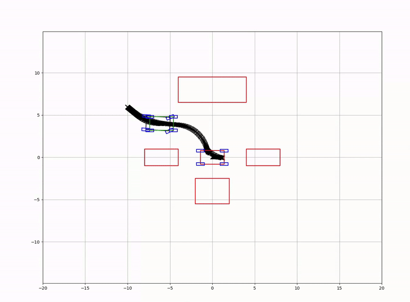

# Optimal Parking
[](https://github.com/CMaybe/Optimal-Parking/actions/workflows/optimal-parking.yaml)

Optimal Parking is a project designed to optimize vehicle trajectories for parking scenarios using advanced mathematical models and optimization techniques. Visualization is handled via **matplotlibcpp**

## Features
- **Trajectory Optimization**: Implements Sequential Quadratic Programming (SQP) for trajectory planning.
- **System Modeling**: Models vehicle dynamics using state-space representations.
- **Obstacle Avoidance**: Incorporates static obstacle avoidance using geometric constraints.
- **Path Planning with RRT***: Uses the RRT* algorithm to generate an initial feasible trajectory.
- **Visualization**: Real-time visualization of vehicle trajectories and obstacles using `matplotlibcpp`.
- **Configurable Parameters**: Easily modify parameters such as vehicle dimensions, trajectory time, and optimization weights via a `config.yaml` file.
- **Devcontainer Support**: Quickly set up a development environment using Docker and Visual Studio Code.
---

## Dependencies
To build and run this project, the following dependencies are required:

- **C++ Compiler**: A C++17 compatible compiler (e.g., `g++`, `clang`).
- **CMake**: Version 3.27.4 or higher.
- **Eigen**: Version 3.4.0 for matrix operations ([Eigen Official Site](https://eigen.tuxfamily.org/)).
- **yaml-cpp**: For parsing YAML configuration files.
- **OsqpEigen**: Version 0.10.0 for quadratic programming ([OsqpEigen GitHub](https://github.com/robotology/osqp-eigen)).
- **matplotlibcpp**: For real-time visualization ([matplotlibcpp GitHub](https://github.com/lava/matplotlib-cpp)).
- **Python3**: For `matplotlibcpp` and `numpy` integration.

## Documentation

For detailed information about the project, including system architecture, mathematical models, and configuration examples, please refer to the PDF files in the `docs` folder:

- [English Documentation](docs/en.pdf)
- [Korean Documentation](docs/kor.pdf)

## Getting Started on Devcontainer (Recommended)
This repository is configured with a `devcontainer` for Visual Studio Code, allowing you to quickly set up and use the development environment using Docker.

### 1. Clone the Repository
```bash
git clone https://github.com/CMaybe/Optimal-Parking.git
cd Optimal-Parking
code .
```
### 2. Open in VSCode

Open the cloned repository in Visual Studio Code. VSCode will detect the devcontainer configuration and prompt you to reopen the folder in the container.

### 3. Reopen in Container

Follow the prompt to reopen the repository in the Docker container. VSCode will build and start the container as defined in the .devcontainer directory, setting up the development environment according to the configuratio.

#### (Option: Access the Container Directly)
If you prefer to access the container directly, you can use the following command:

```bash
xhost +local:docker
docker exec -it dev-optimal-parking /bin/bash
``` 

We also prepared Docker image [dev-optimal-parking](https://github.com/users/CMaybe/packages/container/package/dev-optimal-parking) for the developers. 
``` bash
docker pull ghcr.io/cmaybe/dev-optimal-parking:latest
```


### Build and install `optimal parking`
If you are using the provided Dockerfile or Devcontainer, all dependencies will be installed automatically.

**Build**  
```bash
mkdir optimal_parking/build && cd optimal_parking/build
cmake -DCMAKE_BUILD_TYPE=Release ..
make -j
```
**Install**
```bash
sudo make install # default prefix is /usr/local
```

## Configuration
The project uses a `config.yaml` file for parameter configuration. Below is an example configuration

```yaml
vehicle_length: 2.8
vehicle_width: 1.6

initial_pose: [-6, 4, 0, 0, 0]
goal_pose: [0, 0., 0, 0, 0]

trajectory_time: 70
Ts: 0.1


# x and y position, orientation, velocity, and acceleration
state_lowerbound: [-100.0, -100.0, -3.15, -10, -0.63792]
state_upperbound: [100.0, 100.0, 3.15, 10, 0.63792]

# input: acceleration and steering angle
input_lowerbound: [-1.0, -1.0]
input_upperbound: [2.0, 2.0]


state_weight: [0.0, 0.0, 0.0, 0.0, 0.0]
input_weight: [1.0, 10.0]

n_sqp: 100
qp_iteration: 1000
rho_goal: 10000.0
rho_obs: 10.0


obstacles:
  - center: [-6.0 ,0.0]
    length: 4.0
    width: 2.0
    yaw: 0.0
  - center: [6.0, 0.0]
    length: 4.0
    width: 2.0
    yaw: 0.0
  - center: [0.0, -4.0]
    length: 4.0
    width: 3.0
    yaw: 0.0
  - center: [0.0, 8.0]
    length: 10.0
    width: 3.0
    yaw: 0.0
safety_margin: 0.0


# RRT* parameters
max_iterations: 10000
goal_bias: 0.1
map_x_min: -30.0
map_x_max: 30.0
map_y_min: -30.0
map_y_max: 30.0
goal_radius : 0.1
step_dist : 0.9
rewire_radius : 1.5
```


## Examples
An example for visualize trajecotry is included in the repository. You can find it in the `example` directory:
```bash
cd example
mkdir build && cd build
cmake -DCMAKE_BUILD_TYPE=Release ..
make -j
# run
./to_example 
```
#### Result




## WIP ...

## TODO
-  Enhance technical documentation:
  - Add detailed explanations for the mathematical models used.
  - Include diagrams for system architecture and control flow.
- Set up Continuous Integration (CI):
  - Add GitHub Actions for automated builds and tests.
  - Include static analysis tools (e.g., clang-tidy, cppcheck).
  - Run unit tests using Google Test.
- Implement a benchmarking tool to evaluate performance under different scenarios.
