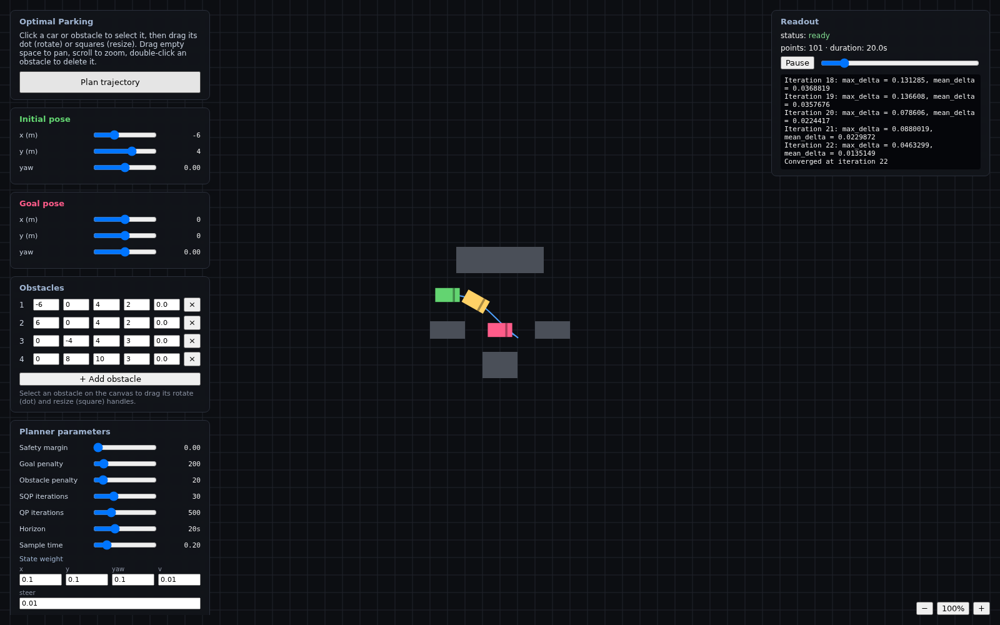
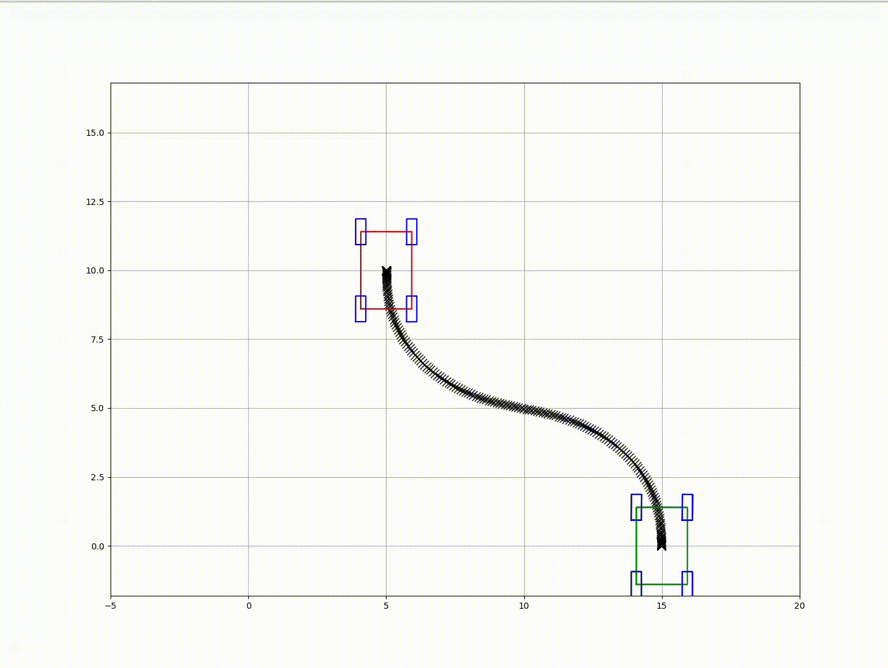
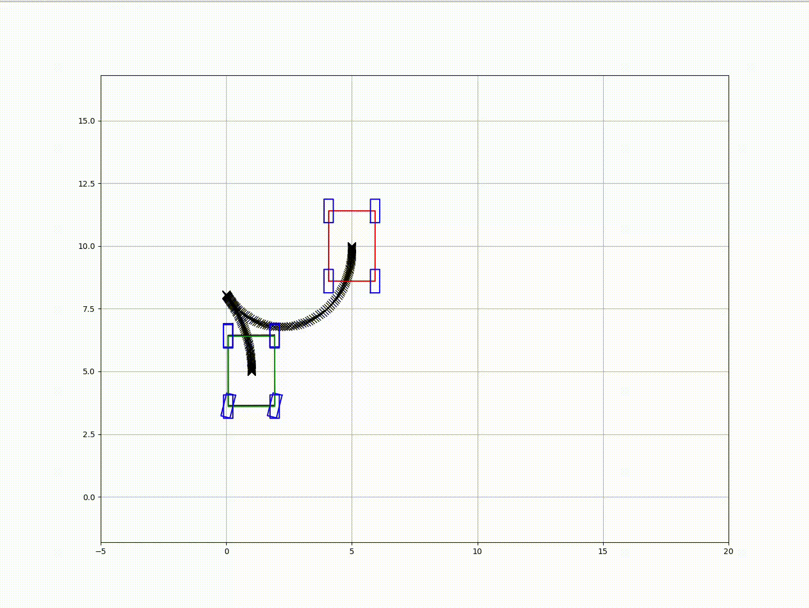
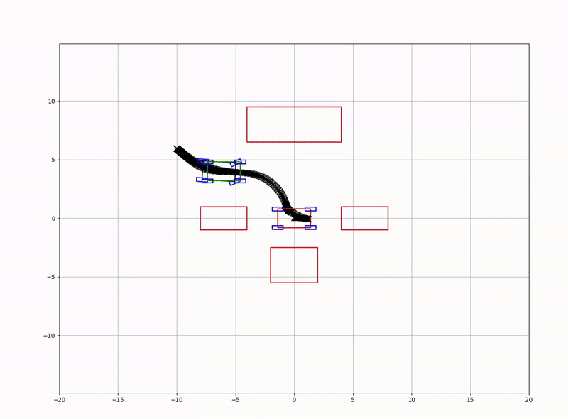

# Optimal Parking

[](https://github.com/CMaybe/Optimal-Parking/actions/workflows/optimal-parking.yaml)
[](https://github.com/CMaybe/Optimal-Parking/actions/workflows/deploy-pages.yaml)

Optimal Parking generates and visualizes vehicle trajectories for parking
scenarios using a kinematic vehicle model and numerical optimization. The
planner uses RRT* to generate an initial geometric path and an SQP-like
sequence of quadratic programs (QPs) to refine it. Visualization is provided
by `matplotlibcpp`.

## Web demo

The planner also compiles to WebAssembly and runs entirely in the browser — no
backend, no install. Try it live:

**[cmaybe.github.io/Optimal-Parking](https://cmaybe.github.io/Optimal-Parking/)**



Every push to `main` runs `.github/workflows/deploy-pages.yaml`, which builds
the WASM module and the React frontend and deploys them to GitHub Pages (set
Settings > Pages > Build and deployment to "GitHub Actions" once for this
repository).

### Controls

| Action | Effect |
| --- | --- |
| Click a car or obstacle | Select it (shows its rotate/resize handles) |
| Drag a car/obstacle body | Move it |
| Drag the white dot | Rotate the selected object |
| Drag an obstacle's orange squares | Resize its length/width |
| Double-click an obstacle | Delete it |
| Drag empty canvas space | Pan the view |
| Scroll wheel | Zoom toward the cursor |
| Sidebar sliders/fields | Tune poses, obstacles, and every SQP parameter (weights, bounds, horizon, penalties, iteration counts) |
| Plan trajectory | Runs the solver and animates the result, with live convergence logs in the Readout panel |

### Local development

```bash
source <path-to-emsdk>/emsdk_env.sh
./scripts/build_wasm_deps.sh   # builds OSQP/osqp-eigen/yaml-cpp for wasm (one-time)
./scripts/build_wasm.sh        # builds optimal_parking + bindings -> web/public/wasm
cd web && npm install && npm run dev
```

Open the printed `http://localhost:5173` (or whichever port webpack-dev-server
picks) in a browser. To produce a static production build (the same one CI
deploys):

```bash
cd web && npm run build   # outputs web/dist
```

Source layout:

- `optimal_parking/bindings/wasm/bindings.cpp` — embind wrapper exposing
  `TrajectoryOptimizer` to JavaScript.
- `scripts/build_wasm_deps.sh` / `scripts/build_wasm.sh` — build the wasm
  dependencies and the module itself; both are reused by CI.
- `web/` — the React + webpack frontend (`web/src/App.jsx`).


## Features

- **Trajectory optimization**: Refines a trajectory through iterative QP
  solves with OSQP.
- **Vehicle modeling**: Represents position, heading, velocity, and steering
  angle with a five-state kinematic bicycle model.
- **Obstacle avoidance**: Applies locally linearized geometric obstacle
  constraints with configurable safety margins.
- **RRT* path planning**: Generates an initial geometric path before QP
  refinement.
- **Visualization**: Plots trajectories, vehicle states, and obstacles with
  `matplotlibcpp`.
- **Configurable parameters**: Loads vehicle dimensions, bounds, timing,
  optimization weights, and planner settings from a YAML file.
- **Interactive web demo**: Runs the same C++ planner as WebAssembly, with a
  drag/zoom/pan canvas UI for editing poses and obstacles and tuning every SQP
  parameter live (see [Web demo](#web-demo)).
- **Dev Container support**: Provides a Docker-based development environment
  for Visual Studio Code.

## Dependencies

The project requires:

- A C++20-compatible compiler, such as `g++` or `clang`.
- CMake 3.27.4 or later.
- Eigen 3.4 or later for matrix operations
  ([Eigen](https://eigen.tuxfamily.org/)).
- `yaml-cpp` for YAML configuration parsing.
- `OsqpEigen` 0.10.0 for QP solving
  ([OsqpEigen](https://github.com/robotology/osqp-eigen)).
- Python 3, including NumPy, for `matplotlibcpp` integration.
- `matplotlibcpp` for visualization
  ([matplotlibcpp](https://github.com/lava/matplotlib-cpp)).

The provided Dockerfile and Dev Container configuration install the required
packages in the development container.

## Documentation

Detailed descriptions of the system model, optimization problem, and planner
are available in the `docs` directory:

- [English Markdown documentation](docs/README.md)
- [Korean Markdown documentation](docs/README.ko.md)
- [English PDF documentation](docs/en.pdf)
- [Korean PDF documentation](docs/kor.pdf)

## Getting Started with the Dev Container

The repository includes a Dev Container configuration for Visual Studio Code.
Using it is the recommended way to prepare the development environment.

### 1. Clone the repository

```bash
git clone https://github.com/CMaybe/Optimal-Parking.git
cd Optimal-Parking
code .
```

### 2. Open the repository in Visual Studio Code

Open the cloned repository in Visual Studio Code. VS Code detects the Dev
Container configuration and prompts you to reopen the folder in the container.

### 3. Reopen in the container

Follow the prompt to reopen the repository in the container. VS Code builds and
starts the container according to the configuration in `.devcontainer`.

#### Optional: access the container directly

If you need to access the running container from a terminal, use:

```bash
xhost +local:docker
docker exec -it dev-optimal-parking /bin/bash
```

A prebuilt development image is also available:

```bash
docker pull ghcr.io/cmaybe/dev-optimal-parking:latest
```

See the [development container package](https://github.com/users/CMaybe/packages/container/package/dev-optimal-parking)
for more information.

## Build and Install the Library

When using the provided Dockerfile or Dev Container, the required dependencies
are installed automatically.

### Build

```bash
cmake -S optimal_parking -B optimal_parking/build \
  -DCMAKE_BUILD_TYPE=Release
cmake --build optimal_parking/build --parallel
```

### Install

```bash
sudo cmake --install optimal_parking/build
```

The default install prefix is `/usr/local`.

### Run clang-tidy

```bash
cmake -S optimal_parking -B optimal_parking/build \
  -DCMAKE_BUILD_TYPE=Debug \
  -DOPTIMAL_PARKING_ENABLE_CLANG_TIDY=ON
cmake --build optimal_parking/build --parallel
```

The `.clang-tidy` configuration is applied automatically to library sources
when `OPTIMAL_PARKING_ENABLE_CLANG_TIDY` is enabled.

## Configuration

The planner reads parameters from a YAML file. The following example shows the
required keys and their meanings:

```yaml
vehicle_length: 2.8
vehicle_width: 1.6

initial_pose: [-6, 4, 0, 0, 0]
goal_pose: [0, 0, 0, 0, 0]

trajectory_time: 70
Ts: 0.1

# velocity and steering angle bounds (x, y, yaw are left unconstrained)
velocity_steer_lowerbound: [-10.0, -0.63792]
velocity_steer_upperbound: [10.0, 0.63792]

# acceleration and steering-rate input
input_lowerbound: [-1.0, -1.0]
input_upperbound: [2.0, 2.0]

state_weight: [0.0, 0.0, 0.0, 0.0, 0.0]
input_weight: [1.0, 10.0]

n_sqp: 100
qp_iteration: 1000
rho_goal: 10000.0
rho_obs: 10.0

obstacles:
  - center: [-6.0, 0.0]
    length: 4.0
    width: 2.0
    yaw: 0.0
  - center: [6.0, 0.0]
    length: 4.0
    width: 2.0
    yaw: 0.0
  - center: [0.0, -4.0]
    length: 4.0
    width: 3.0
    yaw: 0.0
  - center: [0.0, 8.0]
    length: 10.0
    width: 3.0
    yaw: 0.0

safety_margin: 0.0

# RRT* parameters
max_iterations: 10000
goal_bias: 0.1
map_x_min: -30.0
map_x_max: 30.0
map_y_min: -30.0
map_y_max: 30.0
goal_radius: 0.1
step_dist: 0.9
rewire_radius: 1.5
```

## Example

The `example` directory contains a trajectory visualization example. Build it
after installing the `optimal_parking` library:

```bash
cmake -S example -B example/build \
  -DCMAKE_BUILD_TYPE=Release
cmake --build example/build --parallel
cd example/build
./to_example
```

Example results:





## Work in Progress

The project is still under active development.

## TODO

- Expand the technical documentation with system architecture and control-flow diagrams.
- Extend continuous integration with automated builds, static analysis, and unit tests.
- Add benchmarking tools for comparing planner performance across scenarios.
