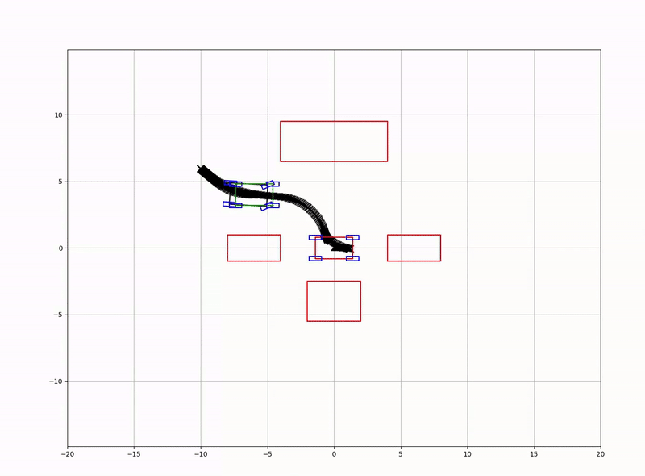

# Autonomous Parking System Documentation

## 🔍 Project Overview

This project focuses on computing and visualizing an optimal, collision-free parking trajectory and control inputs for a vehicle in a complex parking environment, considering its physical constraints.

## 🔧 Development Environment and Technologies

- **Programming Language**: C++
- **Computational Libraries**: Eigen, OSQP
- **Development Tools**: VSCode, Docker
- **Development Environment**: Ubuntu 22.04

## ❓ Objective

Develop an autonomous parking system using optimization techniques:

- Generate a safe parking trajectory in tight parking spaces with various obstacles, accounting for the vehicle's kinematic properties.
- Solve the optimization problem caused by the vehicle's nonlinear dynamics and various constraints using the Sequential Quadratic Programming (SQP) method.

## 🧮 Algorithm

To generate an optimal parking trajectory, the following algorithms are implemented:

- **RRT*** (Rapidly-exploring Random Tree Star): Generates an initial path considering obstacle avoidance constraints.
- **SQP**: Performs optimization based on the initial path generated by RRT*.

## 🧠 System Design

The system model to represent and control the vehicle's state is designed as follows:

$$
\mathbf{x}(t) = \begin{bmatrix} p_x(t) \\ p_y(t) \\ \theta(t) \\ v(t) \\ \delta(t) \end{bmatrix}
$$

$$
\mathbf{u}(t) = \begin{bmatrix} a(t) \\ \dot{\delta}(t) \end{bmatrix}
$$

- A 5-dimensional state space is defined to represent the vehicle's position, heading angle, velocity, and steering angle.
- The vehicle's acceleration and steering angle rate are used as control inputs.

## 🔢 Optimization Problem Formulation and QP Transformation

### 1. Optimization Problem Design

- **Objective Function**  
  Minimize the weighted combination of control input magnitudes ($u_1^2(t) + u_2^2(t)$) and slack variables for goal tracking ($s_{\text{goal}}$) and obstacle avoidance ($s_{\text{obs}}(t)$) with weights $\lambda_{\text{goal}}$ and $\lambda_{\text{obs}}$.

  $$
  J(\mathbf{u}(t), s_{\text{goal}}, s_{\text{obs}}(t)) = \int_{0}^{T} \left( u_1^2(t) + u_2^2(t) + \lambda_{\text{goal}} s_{\text{goal}} + \lambda_{\text{obs}} s_{\text{obs}}(t) \right) \mathrm{d}t
  $$

- **Constraints**  
  - **Dynamics**: The state $\mathbf{x}(t)$ follows the dynamics function $f(\mathbf{x}(t), \mathbf{u}(t))$.  
    $$
    \dot{\mathbf{x}}(t) = f(\mathbf{x}(t), \mathbf{u}(t))
    $$
  - **Initial and Final Conditions**:  
    - Initial state: $\mathbf{x}(0) = \mathbf{x}_{\text{init}}$  
    - Final state: $\mathbf{x}(T) = \mathbf{x}_{\text{goal}} + s_{\text{goal}}$  
    - Initial and final control inputs: $\mathbf{u}(0) = \mathbf{u}_{\text{init}}$, $\mathbf{u}(T) = \mathbf{u}_{\text{goal}}$  
  - **Obstacle Avoidance**: The distance between the state and obstacles ($d(\mathbf{x}(t), \mathcal{O}_j)$) must be at least $d_{\text{min}}$, relaxed by the slack variable $s_{\text{obs}}(t) \geq 0$.  
    $$
    d(\mathbf{x}(t), \mathcal{O}_j) \geq d_{\text{min}} - s_{\text{obs}}(t), \quad s_{\text{obs}}(t) \geq 0, \quad \forall t \in [0, T], \ \forall j \in \{1, \dots, N_{\text{obs}}\}
    $$
  - **Physical Constraints**:  
    - Velocity: $v_{\min} \leq v(t) \leq v_{\max}$  
    - Steering angle: $\delta_{\min} \leq \delta(t) \leq \delta_{\max}$  
    - Acceleration: $a_{\min} \leq a(t) \leq a_{\max}$  
    - Steering angle rate: $\dot{\delta}_{\min} \leq \dot{\delta}(t) \leq \dot{\delta}_{\max}$

  $$
  \begin{align}
  \min_{\mathbf{u}, s_{\text{goal}}, \mathbf{s}_{\text{obs}}} \quad & J(\mathbf{u}(t), s_{\text{goal}}, s_{\text{obs}}(t)) = \int_{0}^{T} \left( u_1^2(t) + u_2^2(t) + \lambda_{\text{goal}} s_{\text{goal}} + \lambda_{\text{obs}} s_{\text{obs}}(t) \right) \mathrm{d}t \\
  \text{s.t.} \quad & \dot{\mathbf{x}}(t) = f(\mathbf{x}(t), \mathbf{u}(t)), \\
  & \mathbf{x}(0) = \mathbf{x}_{\text{init}}, \quad \mathbf{x}(T) = \mathbf{x}_{\text{goal}} + s_{\text{goal}}, \\
  & \mathbf{u}(0) = \mathbf{u}_{\text{init}}, \quad \mathbf{u}(T) = \mathbf{u}_{\text{goal}}, \\
  & d(\mathbf{x}(t), \mathcal{O}_j) \geq d_{\text{min}} - s_{\text{obs}}(t), \quad s_{\text{obs}}(t) \geq 0, \quad \forall t \in [0, T], \ \forall j \in \{1, \dots, N_{\text{obs}}\}, \\
  & v_{\min} \leq v(t) \leq v_{\max}, \\
  & \delta_{\min} \leq \delta(t) \leq \delta_{\max}, \\
  & a_{\min} \leq a(t) \leq a_{\max}, \\
  & \dot{\delta}_{\min} \leq \dot{\delta}(t) \leq \dot{\delta}_{\max},
  \end{align}
  $$

### 2. Discretization and SQP Transformation

The continuous-time problem is discretized and transformed into an SQP framework, approximating the nonlinear optimization problem as a series of linearized Quadratic Programming (QP) problems.

- **Discretized Objective Function**  
  Divide the time interval $[0, T]$ into $N$ segments, minimizing the weighted sum of control inputs and slack variables in each segment.  
  $$
  J = \sum_{k=0}^{N-1} \left( u_1^2[k] + u_2^2[k] + \lambda_{\text{goal}} s_{\text{goal}} + \lambda_{\text{obs}} s_{\text{obs}}[k] \right) \Delta t
  $$

- **Discretized Constraints**  
  - **Dynamics**: State changes follow linearized dynamics.  
    $$
    \Delta \mathbf{x}[k+1] = \mathbf{A}_k \Delta \mathbf{x}_k + \mathbf{B}_k \Delta \mathbf{u}_k + \mathbf{g}_k, \quad k = 0, 1, \dots, N-1
    $$
  - **Initial and Final Conditions**:  
    - $\mathbf{x}[0] = \mathbf{x}_{\text{init}}$, $\mathbf{x}[N] = \mathbf{x}_{\text{goal}} + s_{\text{goal}}$  
    - $\mathbf{u}[0] = \mathbf{u}_{\text{init}}$, $\mathbf{u}[N] = \mathbf{u}_{\text{goal}}$  
  - **Obstacle Avoidance**: Distance constraints are expressed in linearized form.  
    $$
    d(\mathbf{x}[k], \mathcal{O}_j) + \frac{\partial d(\mathbf{x}[k], \mathcal{O}_j)}{\partial \mathbf{x}} \Delta \mathbf{x}_k \geq d_{\text{min}} - s_{\text{obs}}[k], \quad s_{\text{obs}}[k] \geq 0
    $$
  - **Physical Constraints**:  
    - Velocity: $v_{\min} \leq \mathbf{c}_v^T (\mathbf{x}[k] + \Delta \mathbf{x}[k]) \leq v_{\max}$  
    - Steering angle: $\delta_{\min} \leq \mathbf{c}_\delta^T (\mathbf{x}[k] + \Delta \mathbf{x}[k]) \leq \delta_{\max}$  
    - Acceleration: $a_{\min} \leq \mathbf{c}_a^T (\mathbf{u}[k] + \Delta \mathbf{u}[k]) \leq a_{\max}$  
    - Steering angle rate: $\dot{\delta}_{\min} \leq \mathbf{c}_{\dot{\delta}}^T (\mathbf{u}[k] + \Delta \mathbf{u}[k]) \leq \dot{\delta}_{\max}$

  $$
  \begin{align}
  \min_{\Delta \mathbf{u}, s_{\text{goal}}, \mathbf{s}_{\text{obs}}} \quad & J = \sum_{k=0}^{N-1} \left( u_1^2[k] + u_2^2[k] + \lambda_{\text{goal}} s_{\text{goal}} + \lambda_{\text{obs}} s_{\text{obs}}[k] \right) \Delta t \\
  \text{s.t.} \quad & \Delta \mathbf{x}[k+1] = \mathbf{A}_k \Delta \mathbf{x}_k + \mathbf{B}_k \Delta \mathbf{u}_k + \mathbf{g}_k, \quad k = 0, 1, \dots, N-1, \\
  & \mathbf{x}[0] = \mathbf{x}_{\text{init}}, \quad \mathbf{x}[N] = \mathbf{x}_{\text{goal}} + s_{\text{goal}}, \\
  & \mathbf{u}[0] = \mathbf{u}_{\text{init}}, \quad \mathbf{u}[N] = \mathbf{u}_{\text{goal}}, \\
  & d(\mathbf{x}[k], \mathcal{O}_j) + \frac{\partial d(\mathbf{x}[k], \mathcal{O}_j)}{\partial \mathbf{x}} \Delta \mathbf{x}_k \geq d_{\text{min}} - s_{\text{obs}}[k], \quad s_{\text{obs}}[k] \geq 0, \\
  & v_{\min} \leq \mathbf{c}_v^T (\mathbf{x}[k] + \Delta \mathbf{x}[k]) \leq v_{\max}, \\
  & \delta_{\min} \leq \mathbf{c}_\delta^T (\mathbf{x}[k] + \Delta \mathbf{x}[k]) \leq \delta_{\max}, \\
  & a_{\min} \leq \mathbf{c}_a^T (\mathbf{u}[k] + \Delta \mathbf{u}[k]) \leq a_{\max}, \\
  & \dot{\delta}_{\min} \leq \mathbf{c}_{\dot{\delta}}^T (\mathbf{u}[k] + \Delta \mathbf{u}[k]) \leq \dot{\delta}_{\max}
  \end{align}
  $$

### 3. QP Problem Transformation

The SQP problem is converted into a standard QP form for solving.

- **Variable Vector**  
  $$
  \mathbf{z} = \begin{bmatrix} \Delta \mathbf{x}_1 \\ \Delta \mathbf{x}_2 \\ \vdots \\ \Delta \mathbf{x}_{N+1} \\ \Delta \mathbf{u}_1 \\ \Delta \mathbf{u}_2 \\ \vdots \\ \Delta \mathbf{u}_N \\ s_{\text{goal}} \\ s_{\text{obs},1} \\ s_{\text{obs},2} \\ \vdots \\ s_{\text{obs},N} \end{bmatrix}
  $$

- **QP Objective Function**  
  Minimize the quadratic cost of the variable vector $\mathbf{z}$ (state changes $\Delta \mathbf{x}$, control input changes $\Delta \mathbf{u}$, and slack variables $s_{\text{goal}}, s_{\text{obs}}$).  
  $$
  \min_{\mathbf{z}} \quad \frac{1}{2} \mathbf{z}^T \begin{bmatrix}
  \mathbf{Q} & \mathbf{0} & \mathbf{0} & \mathbf{0} \\
  \mathbf{0} & \mathbf{R} & \mathbf{0} & \mathbf{0} \\
  \mathbf{0} & \mathbf{0} & \mathbf{\Lambda}_{\text{goal}} & \mathbf{0} \\
  \mathbf{0} & \mathbf{0} & \mathbf{0} & \mathbf{\Lambda}_{\text{obs}}
  \end{bmatrix} \mathbf{z}
  $$  
  where $\mathbf{Q}$, $\mathbf{R}$, $\mathbf{\Lambda}_{\text{goal}}$, and $\mathbf{\Lambda}_{\text{obs}}$ are weighting matrices for states, control inputs, goal slack, and obstacle slack, respectively.

- **Constraints**  
  - **Linear Equality Constraints**: Dynamics and initial/final conditions.  
    $$
    \mathbf{A} \mathbf{z} = \mathbf{b}
    $$
  - **Linear Inequality Constraints**: Obstacle avoidance and physical constraints.  
    $$
    \mathbf{G} \mathbf{z} \leq \mathbf{h}
    $$

### 4. Trajectory Update

Using the solution $\mathbf{z}$ from the QP problem, update the states $\mathbf{x}$ and control inputs $\mathbf{u}$. Repeat this process to generate the optimal trajectory, ultimately solving the optimization problem.

## 📊 Development Results

- Simulations are performed using the generated control inputs.
- The system can be simulated for various parking scenarios by adjusting parameters (via YAML files).